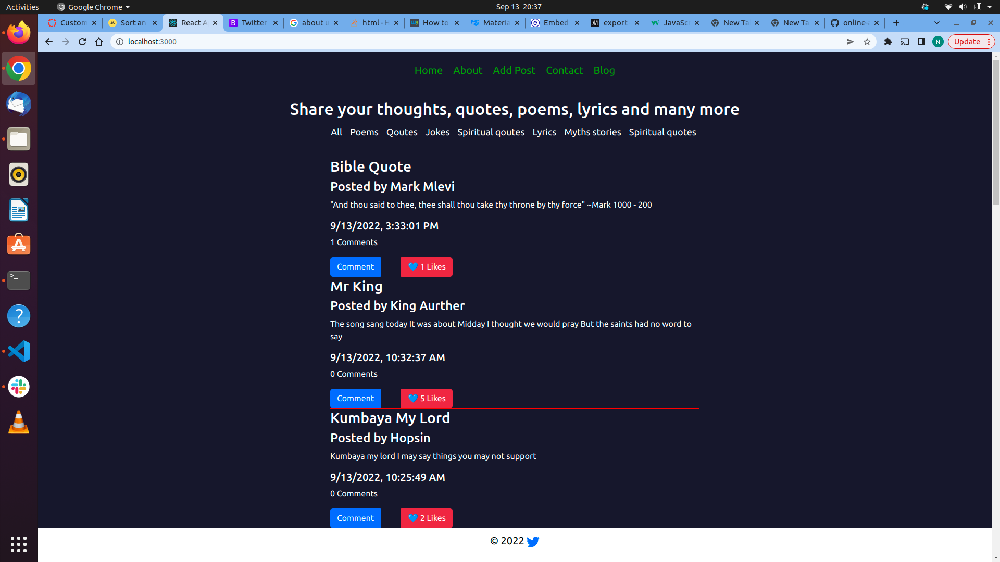
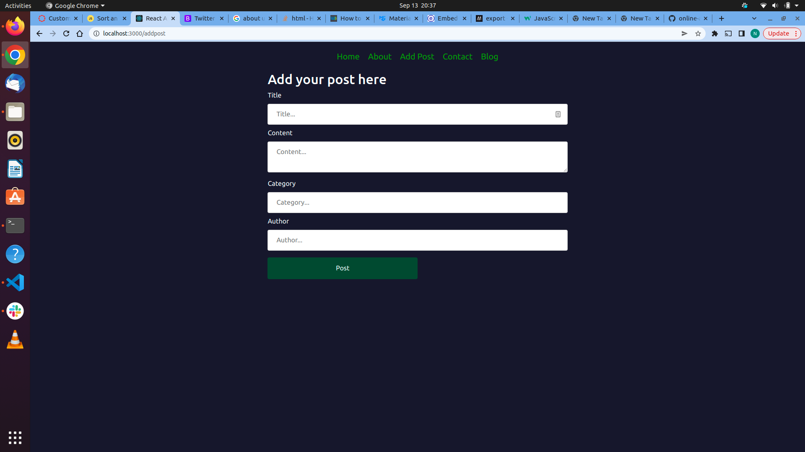
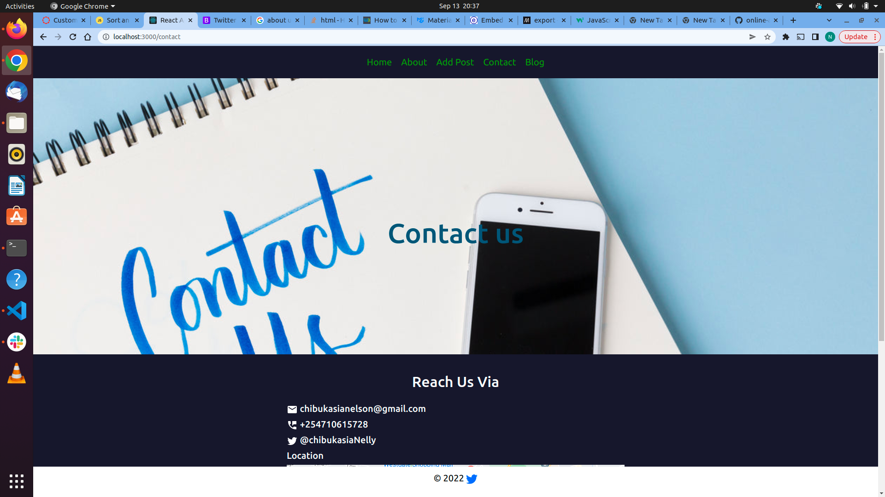
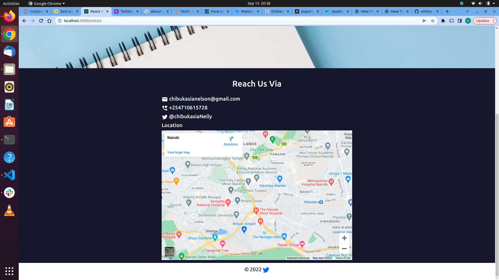

# Free Posts
## Description
Free posts is a web based application that allows users to add and views posts created by other users. 
A user can add a post, comment and like a post. The posts have different variations ranging from articles, poems, jokes, stories, quotes, to spiritual quotes. 
## Running the application 
The project uses a react frontend application that uses an API created from this backend server. The client side of this application is [here](https://github.com/chibukasia/public-posts-client)
### set up
To run the application on your computer, you will have to first clone and run this backend provided. Then clone the front end from the link provided above into you computer. First set up the backend as follows before setting up the frontend react application.

### prequisites 
To run the server, you will need the following installed on your computer 
- ruby 
### Configurations 
Run `bundle install` to intall all the gem files and other dependencies
Run `rake db:migrate` to migrate any pending migrations
Run `rake db:seed:replant` to populate the database with the seed data 
Run `rake server` to start the server on localhost 

Proceed to set up the frontend application using [this](https://github.com/chibukasia/public-posts-client) repo

### Sample screenshots from the project 
#### The Home page 

#### Add post 

#### Contact us 

